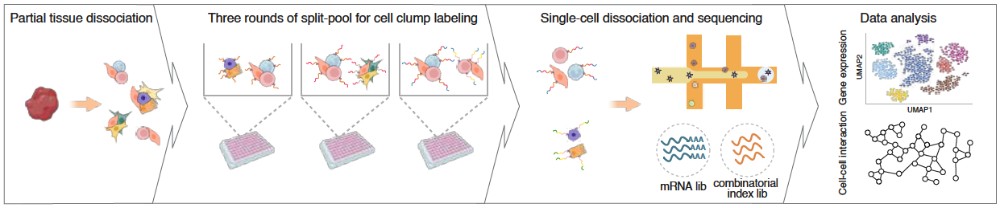
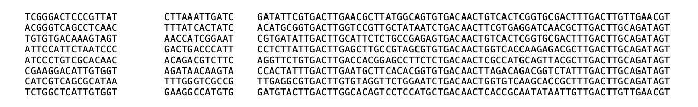

# :sparkles: CCI-seq :sparkles: 

This repository provides the official implementation of the data analysis pipeline described in our study：

## :dart: Resolving cell-cell interaction networks and their molecular logic in complex tissues
<p align="center"></p>
<p align="justify" >
Cells in complex organisms function through extensive interactions, yet mapping these interaction networks at scale remains challenging. Here, we present CCI-seq, a high-throughput method to unbiasedly capture <ins>c</ins>ell-<ins>c</ins>ell <ins>i</ins>nteractions by <b>combining cell clump combinatorial indexing with single-cell <ins>seq</ins>uencing</b>.
</p>

## Datasets
<p align="justify" >
Raw sequence reads and count matrices generated in this study are available at GSA (Genome Sequence Archive) with accession number <b>PRJCA034558</b>. All processed data supporting the key findings of this study are available at Zenodo repository (https://doi.org/10.5281/zenodo.17445811) or from the corresponding author upon reasonable request. The publicly available mouse small intestine Visium HD dataset can be accessed from the 10x Genomics website (https://www.10xgenomics.com/datasets/visium-hd-cytassist-gene-expression-libraries-of-mouse-intestine).
</p>

## Requirements
- [OS] Linux (official)
- [Software]
    - seqkit: v2.5.1    
    - cutadapt: v4.4
    - umi_tools: v1.1.4
    - cellranger: v7.1.0
	- Python: v3.8.5, numpy==1.23.1, pandas==1.5.1, seaborn==0.13.2, scanpy==1.9.1, scipy==1.10.1, matplotlib==3.7.5, scalex==1.0.2, sklearn==1.2.1, liana==1.5.0
 	- R: v4.3.3, clusterProfiler==4.10.1

## Analysis pipeline
<p align="justify" >
Following sequencing, two 10x standard FASTQ libraries are generated: <b>the mRNA library</b> and <b>the combinatorial index library</b>. </p>
<p align="justify" >
For the mRNA library, we utilize the `cellranger count` pipeline to perform standardized preprocessing, yielding a cell-by-gene expression matrix. </p>
```
cellranger count \
--id=${id} \
--sample=${sample} \
--fastqs=${fastqs} \
--transcriptome=${transcriptome} \
--maxjobs=1
```
<p align="justify" >
For the combinatorial index library, we have established a standardized analytical pipeline from scratch, encompassing <b>data preprocessing</b>, <b>quality control (QC)</b>, and <b>cell-cell interaction analysis</b>.</p>
- **Step 1: data preprocessing** 
This step involves deduplication, adapter trimming, denoising, and format standardization. It converts the input FASTQ files into a `processed.txt` file, the content of which is shown below:
<p align="center"></p>
<p align="justify" >
- **Step 2: QC**

- **Step 3: cell-cell interaction analysis** 


## :round_pushpin: Cite us
If you find this study useful for your research, we kindly ask that you cite our paper:
```
@article{Brixi2026,
    author  = {Tang L, Tian K, Fu X, Xu Y, Wu J, Zhang J, Wang X, Ye C, Wu Q, Wu W, Feng C and Zhang QC},
    title   = {Resolving cell-cell interaction networks and their molecular logic in complex tissues},
    journal = {Nature Methods},
    year    = {2026},
    doi     = {XXX},
    url     = {XXX},
}
```

<!-- CONTACT -->
## :telephone: Contact us
For questions about the paper or code, please contact:

Kang Tian - tiankang@mail.tsinghua.edu.cn

<p align="right">(<a href="#readme-top">back to top</a>)</p>
